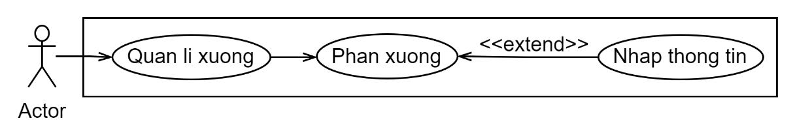
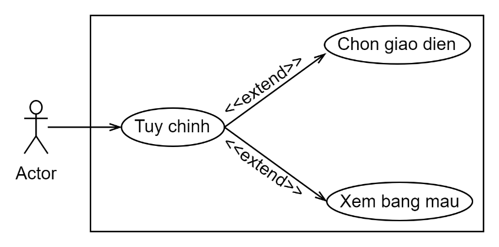
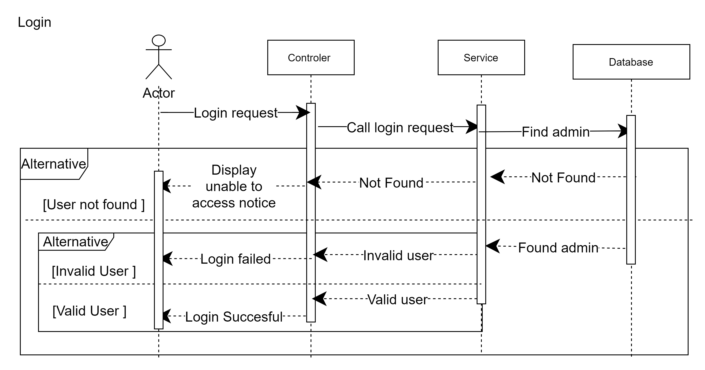
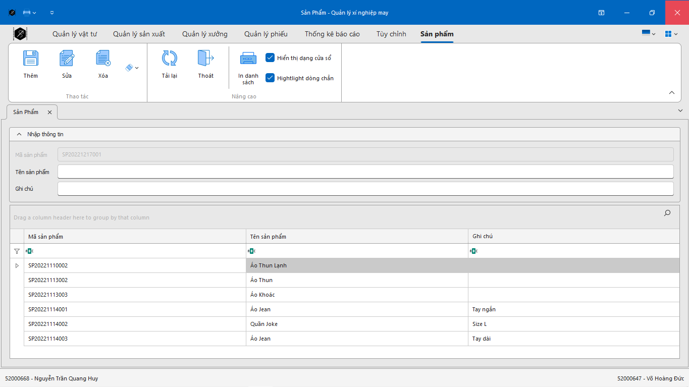

# Quan Ly Xi Nghiep May

> The project is an application development project focused on creating a management system for garment factories, streamlining processes and improving efficiency. It utilizes technologies such as SQL, C#, WinForms, and DevExpress to achieve its objectives.
> Live demo [_here_](https://www.youtube.com/watch?v=R0TUDhHHLJ4&t=444s).

## Table of Contents

- [Quan Ly Xi Nghiep May](#quan-ly-xi-nghiep-may)
  - [Table of Contents](#table-of-contents)
  - [General Information](#general-information)
  - [Technologies Used](#technologies-used)
  - [Features](#features)
  - [Screenshots](#screenshots)
  - [Setup](#setup)
  - [Contact](#contact)

## General Information

- Identify the limitations in the traditional garment industry, such as lack of technological integration and difficulties in data management.
- Develop an application for managing material resources and improving production efficiency in garment factories.
- Enable effective coordination between different production departments and ensure consistent and reliable data.
- Enhance the ability to track and manage production progress, monitor workshop performance, and optimize resource allocation.
- Enable easy access and interaction with the system for administrators, facilitating efficient data retrieval and management.
- Provide a platform for querying and analyzing production data, allowing for informed decision-making and process improvement in the garment industry.

## Technologies Used

- `SQL Server Management Studio (SSMS)` - **version 18.0**: `SSMS` is used as a visual tool to manage the `SQL Server` database. It provides an intuitive environment for developers to interact with the database, including accessing, modifying, and querying data. [Detail](https://learn.microsoft.com/en-us/sql/ssms/download-sql-server-management-studio-ssms?view=sql-server-ver16)

- `Entity Framework` - **version 6.4.4**: `Entity Framework` is an `Object-Relational Mapping (ORM)` library used to map `SQL Server` data to objects. It simplifies database operations by treating data as regular objects with properties and relationships. [Detail](https://learn.microsoft.com/en-us/ef/ef6/)

- `WinForms with C#`: `WinForms` is a framework for building Windows desktop applications using `C#` programming language. It provides a rich set of controls and a familiar event-driven programming model for creating user interfaces. [Detail](https://visualstudio.microsoft.com/)

- `DevExpress` - **version 22.1**: `DevExpress` is a powerful toolset used for designing and developing feature-rich applications. It includes a wide range of visually appealing `UI` controls for `WinForms`, enhancing the application's design and performance. [Detail](https://www.devexpress.com/)

## Features

1. `Login`: Users, specifically the admin, can log in to the system to gain access to the application's functionalities.

1. `Main Screen`: After a successful login, the system displays the main screen of the application, which provides an overview of relevant information and features.

1. `Material Management`: Users can manage materials used in the garment production process. This includes adding, editing, and deleting material information. Additionally, there is a search functionality to find materials by their name.

1. `Factory Management`: Users, particularly the admin, can manage different production factories or workshops. This involves editing, adding, and deleting factory information.

1. `Production Management`: Users have the ability to manage production stages and standards. They can add, edit, and delete information related to production stages and standards.

1. `Document Management`: Users can manage various types of documents, such as receipt and assignment documents. For each document type, users can perform actions like adding, editing, and deleting document information. The system also supports data reloading and provides a table view for easy data manipulation.

1. `Reporting and Statistics`: The application includes reporting and statistical capabilities. Users can select the desired report type, choose report parameters, and generate reports based on the selected criteria.

1. `Customization`: The application provides customization options for the user interface, allowing the admin to choose different interface styles and color schemes.

## Screenshots

| Name       | Screenshots                                      |                                       |
| ---------- | ------------------------------------------------ | ------------------------------------- |
| Database   |           |                                       |
| Database   |  |                                       |
| Database   |           |  |
| Database   |             |  |
| -          | -                                                | -                                     |
| Use Cases  |             |                                       |
| Use Cases  |             |                                       |
| Use Cases  |             |                                       |
| Use Cases  |             |                                       |
| Use Cases  |             |                                       |
| Use Cases  |             |                                       |
| Use Cases  |             |                                       |
| Use Cases  |             |                                       |
| Use Cases  |             |                                       |
| Use Cases  |             |                                       |
| Use Cases  |             |                                       |
| -          | -                                                | -                                     |
| Backup DB  |             |                                       |
| -          | -                                                | -                                     |
| Database   |             |                                       |
| Database   |             |                                       |
| Database   |             |                                       |
| Database   |             |                                       |
| Database   |             |                                       |
| Database   |             |                                       |
| Database   |             |                                       |
| -          | -                                                | -                                     |
| Winform    |             |                                       |
| Winform    |             |                                       |
| Winform    |             |                                       |
| -          | -                                                | -                                     |
| DevExpress |             |                                       |
| DevExpress |             |                                       |
| DevExpress |             |                                       |
| DevExpress |             |                                       |
| DevExpress |             |                                       |
| DevExpress |             |                                       |
| DevExpress |             |                                       |
| DevExpress |             |                                       |
| DevExpress |             |                                       |
| DevExpress |             |                                       |
| DevExpress |             |                                       |
| DevExpress |             |                                       |
| DevExpress |             |                                       |
| DevExpress |             |                                       |
| DevExpress |             |                                       |
| DevExpress |             |                                       |
| DevExpress |             |                                       |
| DevExpress |             |                                       |
| DevExpress |             |                                       |
| DevExpress |             |                                       |
| DevExpress |             |                                       |
| DevExpress |             |                                       |
| DevExpress |             |                                       |
| DevExpress |             |                                       |
| DevExpress |             |                                       |
| DevExpress |             |                                       |
| DevExpress |             |                                       |
| DevExpress |             |                                       |
| DevExpress |             |                                       |
| DevExpress |             |                                       |
| DevExpress |             |                                       |
| DevExpress |             |                                       |
| DevExpress |             |                                       |
| DevExpress |             |                                       |
| -          | -                                                | -                                     |
| Set up     |             |                                       |
| Set up     |             |                                       |
| Set up     |             |                                       |
| Set up     |             |                                       |
| Set up     |             |                                       |
| Set up     |             |                                       |
| Set up     |             |                                       |
| Set up     |             |                                       |
| -          | -                                                | -                                     |
| Unit Tets  |             |                                       |
| -          | -                                                | -                                     |

## Setup

To set up the project and get started, follow these step-by-step instructions:

1. Ensure that your computer meets the following requirements:

- Visual Studio 2022
- DevExpress 22.1
- The database backup file named "backup.bak" available in - the GitHub repository.

2. Clone the project from GitHub by following these steps:

- Open Visual Studio and select "Cloning a repository" from the start page.
- Enter the GitHub repository URL: https://github.com/nguyenhuy158/QuanLyXiNghiepMay/
- Click on "Clone" to start the cloning process.
- Wait for the repository to be cloned successfully.

3. Copy the required .dll files into the project:

- Copy the folders containing the necessary .dll files from the GitHub project into the "SqlServerTypes" folder.

4. Open the "QuanLyXiNghiepMay.sln" file:

- In Visual Studio, navigate to the cloned project folder.
- Open the "QuanLyXiNghiepMay.sln" file to load the solution.

5. Run the project:

- Click on the green "Run" button in Visual Studio to start the application.
- The splash screen will appear.
- After that, the login screen will be displayed.
- Once you log in, the main application screen will appear.

By following these steps, you should be able to set up the project and run it locally on your machine.

## Contact

Created by [@nguyenhuy158](https://github.com/nguyenhuy158/) - feel free to contact me!

E: [huy.ntq02@gmail.com](mailto:huy.ntq02@gmail.com)

Y: [youtube/@ntqh2k2](https://www.youtube.com/@ntqhuy2k2)
